# KC2 Phase 1 Data Model — Detailed Schema

This Mermaid ERD is generated strictly from the approved Phase 1 schema in:

`supabase/migrations/20261001074553_create_phase1_schema.sql`

It includes all 17 approved tables, their columns, primary keys, foreign keys, and the key table relationships defined by the migration. Constraint details that Mermaid ER syntax cannot express fully are summarized after the diagram.

```mermaid
erDiagram
    SOURCE_FILES {
        bigint source_file_id PK
        text drive_file_id UK
        text file_name
        text file_type
        timestamptz created_at
    }

    ACADEMIC_YEARS {
        bigint academic_year_id PK
        text year_label UK
        bigint source_file_id FK
        text source_sheet_name
        integer source_row_number
        timestamptz created_at
    }

    GRADES {
        bigint grade_id PK
        text grade_code UK
        text grade_name UK
        smallint sort_order UK
        bigint source_file_id FK
        text source_sheet_name
        integer source_row_number
        timestamptz created_at
    }

    SUBJECTS {
        bigint subject_id PK
        text subject_name UK
        bigint source_file_id FK
        text source_sheet_name
        integer source_row_number
        timestamptz created_at
    }

    ASSESSMENT_PERIODS {
        bigint assessment_period_id PK
        text period_code UK
        text source_label UK
        smallint sort_order
        bigint source_file_id FK
        text source_sheet_name
        integer source_row_number
        timestamptz created_at
    }

    ASSESSMENT_SCORE_CODES {
        text score_code PK
        text meaning
        bigint source_file_id FK
        text source_sheet_name
        integer source_row_number
        timestamptz created_at
    }

    ATTENDANCE_STATUS_CODES {
        text status_code PK
        text meaning
        bigint source_file_id FK
        text source_sheet_name
        integer source_row_number
        timestamptz created_at
    }

    STUDENTS {
        text student_id PK
        text student_name
        text source_enrollment_year_label
        text gender
        date date_of_birth
        text social_category
        text program_type
        bigint source_file_id FK
        text source_sheet_name
        integer source_row_number
        timestamptz created_at
    }

    STUDENT_GRADE_ENROLLMENTS {
        bigint student_grade_enrollment_id PK
        text student_id FK
        bigint academic_year_id FK
        bigint grade_id FK
        text source_grade_label
        bigint source_file_id FK
        text source_sheet_name
        integer source_row_number
        text source_column_name
        timestamptz created_at
    }

    GRADE_SUBJECTS {
        bigint grade_subject_id PK
        bigint grade_id FK
        bigint subject_id FK
        bigint source_file_id FK
        text source_sheet_name
        integer source_row_number
        timestamptz created_at
    }

    ASSESSMENT_COMPETENCIES {
        bigint competency_id PK
        bigint grade_subject_id FK
        smallint competency_order
        text competency_name
        bigint source_file_id FK
        text source_sheet_name
        integer source_row_number
        timestamptz created_at
    }

    ASSESSMENT_ACTIVITIES {
        bigint activity_id PK
        bigint competency_id FK
        smallint activity_order
        text activity_name
        boolean is_placeholder
        bigint source_file_id FK
        text source_sheet_name
        integer source_row_number
        text source_column_name
        timestamptz created_at
    }

    STUDENT_ASSESSMENTS {
        bigint student_assessment_id PK
        text student_id FK
        bigint academic_year_id FK
        bigint grade_subject_id FK
        bigint assessment_period_id FK
        numeric reported_average_score
        boolean duplicate_candidate
        bigint source_file_id FK
        text source_sheet_name
        integer source_row_number
        timestamptz created_at
    }

    ASSESSMENT_SCORES {
        bigint assessment_score_id PK
        bigint student_assessment_id FK
        bigint activity_id FK
        text raw_score_value
        smallint numeric_score
        text score_code FK
        bigint source_file_id FK
        text source_sheet_name
        integer source_row_number
        text source_column_name
        timestamptz created_at
    }

    ATTENDANCE_MONTHS {
        bigint attendance_month_id PK
        text student_id FK
        bigint academic_year_id FK
        bigint grade_id FK
        smallint month_number
        text source_month_label
        smallint reported_days_present
        smallint reported_days_absent
        numeric reported_attendance_percentage
        boolean duplicate_candidate
        bigint source_file_id FK
        text source_sheet_name
        integer source_row_number
        timestamptz created_at
    }

    ATTENDANCE_DAYS {
        bigint attendance_day_id PK
        bigint attendance_month_id FK
        smallint day_of_month
        text raw_status_code
        text normalized_status_code FK
        bigint source_file_id FK
        text source_sheet_name
        integer source_row_number
        text source_column_name
        timestamptz created_at
    }

    STUDENT_MEASUREMENTS {
        bigint student_measurement_id PK
        bigint attendance_month_id FK
        numeric age_years
        numeric height_cm
        numeric weight_kg
        numeric reported_bmi_value
        text reported_bmi_category
        bigint source_file_id FK
        text source_sheet_name
        integer source_row_number
        timestamptz created_at
    }

    SOURCE_FILES ||--o{ ACADEMIC_YEARS : "source_file_id"
    SOURCE_FILES ||--o{ GRADES : "source_file_id"
    SOURCE_FILES ||--o{ SUBJECTS : "source_file_id"
    SOURCE_FILES ||--o{ ASSESSMENT_PERIODS : "source_file_id"
    SOURCE_FILES ||--o{ ASSESSMENT_SCORE_CODES : "source_file_id"
    SOURCE_FILES ||--o{ ATTENDANCE_STATUS_CODES : "source_file_id"
    SOURCE_FILES ||--o{ STUDENTS : "source_file_id"
    SOURCE_FILES ||--o{ STUDENT_GRADE_ENROLLMENTS : "source_file_id"
    SOURCE_FILES ||--o{ GRADE_SUBJECTS : "source_file_id"
    SOURCE_FILES ||--o{ ASSESSMENT_COMPETENCIES : "source_file_id"
    SOURCE_FILES ||--o{ ASSESSMENT_ACTIVITIES : "source_file_id"
    SOURCE_FILES ||--o{ STUDENT_ASSESSMENTS : "source_file_id"
    SOURCE_FILES ||--o{ ASSESSMENT_SCORES : "source_file_id"
    SOURCE_FILES ||--o{ ATTENDANCE_MONTHS : "source_file_id"
    SOURCE_FILES ||--o{ ATTENDANCE_DAYS : "source_file_id"
    SOURCE_FILES ||--o{ STUDENT_MEASUREMENTS : "source_file_id"

    STUDENTS ||--o{ STUDENT_GRADE_ENROLLMENTS : "student_id"
    ACADEMIC_YEARS ||--o{ STUDENT_GRADE_ENROLLMENTS : "academic_year_id"
    GRADES o|--o{ STUDENT_GRADE_ENROLLMENTS : "grade_id"

    GRADES ||--o{ GRADE_SUBJECTS : "grade_id"
    SUBJECTS ||--o{ GRADE_SUBJECTS : "subject_id"
    GRADE_SUBJECTS ||--o{ ASSESSMENT_COMPETENCIES : "grade_subject_id"
    ASSESSMENT_COMPETENCIES ||--o{ ASSESSMENT_ACTIVITIES : "competency_id"

    STUDENTS ||--o{ STUDENT_ASSESSMENTS : "student_id"
    ACADEMIC_YEARS ||--o{ STUDENT_ASSESSMENTS : "academic_year_id"
    GRADE_SUBJECTS ||--o{ STUDENT_ASSESSMENTS : "grade_subject_id"
    ASSESSMENT_PERIODS ||--o{ STUDENT_ASSESSMENTS : "assessment_period_id"
    STUDENT_ASSESSMENTS ||--o{ ASSESSMENT_SCORES : "student_assessment_id"
    ASSESSMENT_ACTIVITIES ||--o{ ASSESSMENT_SCORES : "activity_id"
    ASSESSMENT_SCORE_CODES o|--o{ ASSESSMENT_SCORES : "score_code"

    STUDENTS ||--o{ ATTENDANCE_MONTHS : "student_id"
    ACADEMIC_YEARS ||--o{ ATTENDANCE_MONTHS : "academic_year_id"
    GRADES ||--o{ ATTENDANCE_MONTHS : "grade_id"
    ATTENDANCE_MONTHS ||--o{ ATTENDANCE_DAYS : "attendance_month_id"
    ATTENDANCE_STATUS_CODES o|--o{ ATTENDANCE_DAYS : "normalized_status_code"
    ATTENDANCE_MONTHS ||--o| STUDENT_MEASUREMENTS : "attendance_month_id"
```

## Schema constraints represented outside the ER syntax

The diagram above does not invent constraints that are absent from the migration. The following migration-defined rules are important when reading it:

- `source_files.drive_file_id` is unique.
- `academic_years.year_label` is unique.
- `grades.grade_code`, `grades.grade_name`, and `grades.sort_order` are individually unique.
- `subjects.subject_name` is unique.
- `assessment_periods.period_code` and `assessment_periods.source_label` are individually unique.
- `student_grade_enrollments(student_id, academic_year_id)` is unique.
- `grade_subjects(grade_id, subject_id)` is unique.
- `assessment_competencies(grade_subject_id, competency_order)` is unique.
- `assessment_activities(competency_id, activity_order)` is unique.
- `assessment_scores(student_assessment_id, activity_id)` is unique.
- `attendance_days(attendance_month_id, day_of_month)` is unique.
- `student_measurements.attendance_month_id` is unique.
- `student_assessments` deliberately has no natural-key unique constraint; its natural duplicate key is indexed non-uniquely.
- `attendance_months` deliberately has no natural-key unique constraint; its natural duplicate key is indexed non-uniquely.
- `student_grade_enrollments.grade_id`, `assessment_scores.score_code`, and `attendance_days.normalized_status_code` are nullable foreign keys.
- `assessment_scores` enforces either numeric score 0–10 or a non-null score code, but not both.
- `attendance_months.month_number` is constrained to 1–12.
- `attendance_days.day_of_month` is constrained to 1–31.
- Provenance row numbers must be positive; cell-level provenance columns must be nonblank where defined.
