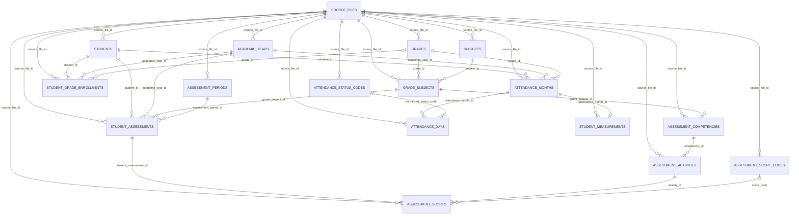

# KC2 Phase 1 Data Model — Overview

This Mermaid ERD is a simplified relationship view generated strictly from the approved Phase 1 schema in:

`supabase/migrations/20261001074553_create_phase1_schema.sql`

It shows all 17 approved tables while intentionally omitting columns so reviewers can see the main entity relationships clearly.

## Notes

- `student_grade_enrollments.grade_id` is nullable in the approved schema.
- `assessment_scores.score_code` is nullable; valid rows contain either a numeric score or a score code according to the approved check constraint.
- `attendance_days.normalized_status_code` is nullable.
- The model intentionally does not enforce natural-key uniqueness for `student_assessments` or `attendance_months`; legitimate source duplicates are retained and flagged using `duplicate_candidate`.
